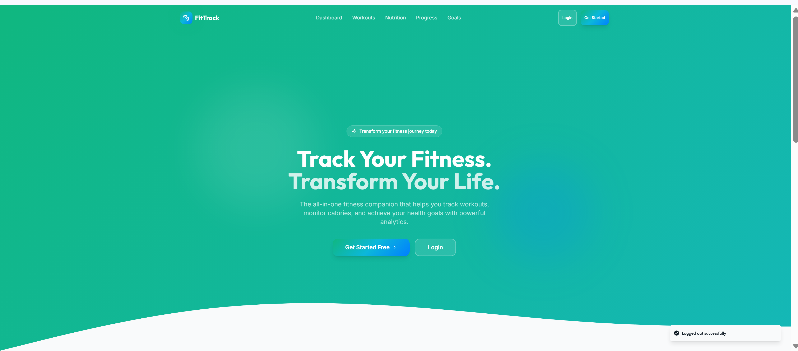
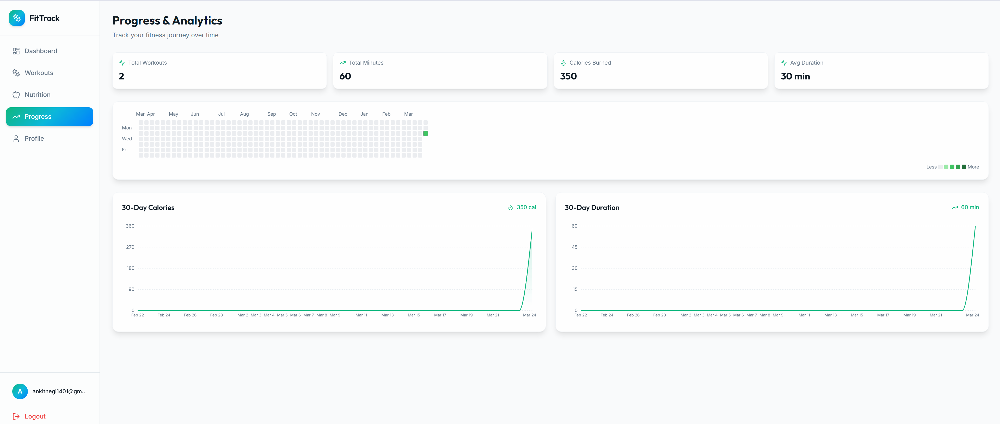

# 🏋️ Fitness Tracker App

A full-stack fitness tracking application to manage workouts, nutrition, and daily calorie intake.

---

## 🚀 Features
- User authentication (Supabase)
- Workout tracking (Create, Edit, Delete)
- Nutrition tracking (Create, Edit, Delete)
- Calorie and macro tracking
- Dashboard with progress insights

---

## 🛠 Tech Stack
- React / Next.js
- Supabase (Backend & Database)
- Tailwind CSS
- Recharts

---

## ⚙️ Setup
1. Clone the repository
2. Install dependencies:
   npm install
3. Run the app:
   npm run dev

---

## 📸 Screenshots

### Landing (Base)

  

### Dashboard & Nutrition

  
  

### Workouts & Progress

  
  

### Profile & Auth

  
  

  

---

## 🔮 Future Improvements
- Weekly analytics dashboard
- Meal recommendations
- Advanced progress tracking